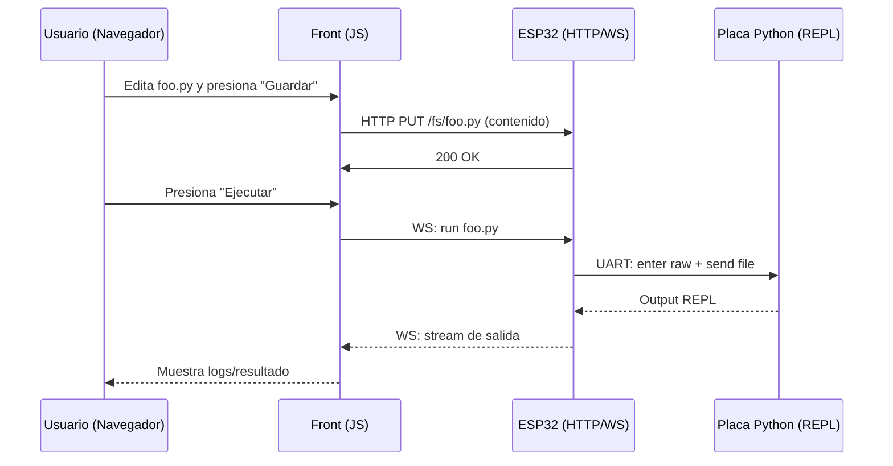
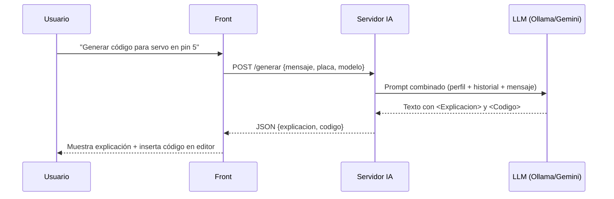

# Arquitectura del Proyecto

## Visión General
EspressIDEA se organiza en una arquitectura modular que separa documentación, software, modelos y pruebas.

### Estructura de Carpetas
- `/docs/`: Documentación extendida, notas técnicas y diagramas.  
- `/hardware/`: Esquemas eléctricos, PCB y diagramas de conexión.  
- `/software/`: Código fuente (backend Flask, scripts de interacción, microcontrolador).  
- `/models/`: Prompts, configuraciones y modelos de LLM.  
- `/tests/`: Pruebas unitarias y de integración.  
- `/examples/`: Ejemplos de uso de la plataforma.  

# Arquitectura de EspressIDEA

EspressIDEA es un editor web embebido para programar placas que ejecutan **MicroPython** o **CircuitPython**, con un **ESP32** actuando como intermediario entre el navegador y la placa destino. Opcionalmente, se conecta a un **servidor de IA** para generar, explicar y documentar código.

## 1. Visión General

```mermaid
graph LR
    A[Navegador<br/>(HTML/CSS/JS)] <--WS/HTTP--> B[ESP32<br/>(ESP-IDF + FreeRTOS)]
    B <--UART REPL--> C[Placa Python<br/>(MicroPython/CircuitPython)]
    B <--HTTP/WS--> D[SPIFFS<br/>(assets del editor)]
    B <--HTTP/REST--> E[(Servidor IA opcional)]
```

- **Navegador**: Cliente web que muestra el editor, el explorador de archivos y la terminal REPL.
- **ESP32**: Sirve el frontend (SPIFFS), expone APIs HTTP/WS y puentea hacia el REPL por UART.
- **Placa Python**: Ejecuta los scripts (MicroPython o CircuitPython).
- **Servidor IA (opcional)**: Servicio externo (por ejemplo, Flask) que usa LLMs locales (Ollama) o en la nube (Gemini) para asistir al usuario.

## 2. Capas y Componentes

### 2.1 Frontend (servido desde ESP32)
**Stack**: HTML, CSS, JavaScript.

**Funciones**:
- Editor con resaltado y acciones básicas (abrir/guardar/descargar).
- Explorador del sistema de archivos remoto.
- Terminal con acceso al REPL vía WebSocket.
- Acciones asistidas por IA: generar, explicar, arreglar, documentar.

### 2.2 Firmware ESP32 (ESP-IDF + PlatformIO)
#### Servicios:
- **HTTP Server**: Sirve assets del frontend y expone endpoints REST mínimos.
- **WebSocket Terminal**: Túnel bidireccional para el REPL.
- **FileServer**: Operaciones de FS remoto (leer, escribir, subir, borrar).
- **WiFi/mDNS**: Provisión de red y descubrimiento (`<host>.local`).

#### Módulos principales (C/C++):
- `ServerManager/`: WiFi, mDNS, HTTP y WS.
- `PyBoardUART/`: Control del REPL por UART (enter raw/exec/exit).
- `EspressIDEA/`: Orquestación (colas FreeRTOS, workers, control de estado).

#### Almacenamiento:
- **SPIFFS**: Frontend embebido, `CREDENTIALS.txt` y preferencias.
- **Persistencia de proyecto**: Archivos `.py` y recursos del usuario.

### 2.3 Conector IA (opcional)
- **Cliente**: El frontend invoca endpoints del servidor IA.
- **Servidor IA**: Flask con rutas como `/generar` que:
  - Combinan prompt + historial + mensaje.
  - Llaman a Ollama o Gemini y devuelven `<Explicacion>` y `<Codigo>`.

## 3. Flujo de Datos

### 3.1 Edición y Ejecución sin IA


### 3.2 Generación Asistida por IA


## 4. Interfaces

### 4.1 HTTP/WS Expuestos por ESP32
- `GET /`: Entrega `index.html` (editor).
- `GET /static/*`: Assets (JS/CSS).
- `GET /fs/list`: Listado de archivos.
- `GET /fs/get?path=/main.py`: Descarga.
- `PUT /fs/put?path=/main.py`: Guarda/crea.
- `DELETE /fs/del?path=/main.py`: Borra.
- `WS /term`: Canal terminal (REPL).

**Mensajes**:
```json
{"op":"write","data":"print(2+2)\n"}
```
```json
{"op":"interrupt"}
```
```json
{"op":"reset"}
```

> **Nota**: Los paths pueden variar según la implementación; documenta los definitivos aquí.

### 4.2 Configuración
**Archivo**: `/data/CREDENTIALS.txt`
```ini
SSID=WIFI_SSID
PASS=WIFI_PASS
HOST=MDNS_HOSTNAME
LLM_URL=http://servidor-ia:5000
```

## 5. Entornos y Despliegue

### 5.1 PlatformIO (ejemplo)
```ini
[env:wemos_d1_mini32]
platform       = espressif32
board          = wemos_d1_mini32
framework      = espidf
monitor_speed  = 115200
```

### 5.2 Tareas de Build
```bash
# Firmware
pio run --target upload

# Assets web (SPIFFS)
pio run --target buildfs
pio run --target uploadfs
```

## 6. Seguridad y Consideraciones
- **Red**: 2.4 GHz obligatoria para WiFi del ESP32.
- **mDNS**: Acceso por `<HOST>.local` en la misma LAN.
- **Aislamiento**: No exponer WS/HTTP del ESP32 a WAN sin proxy/autenticación.
- **Limitación de recursos**: Controlar tamaños de archivo y tiempos de ejecución.
- **REPL**: Sanitizar comandos si en modo “aula compartida”.

## 7. Testing Funcional Sugerido
- **Conectividad**: Ping `HOST.local`, carga del frontend, reconexión WS.
- **FS remoto**: Crear/editar/borrar/descargar.
- **REPL**: Ejecutar, interrumpir, resetear.
- **Estrés**: Envío de archivos grandes, loops prolongados, cortes de red.
- **IA**: Generación y explicación con respuestas bien formadas.

> Ver `/tests/` para checklists detallados.

## 8. Estructura del Repositorio (Referencia)
```bash
EspressIDEA/
├── data/                     # HTML/CSS/JS del frontend (SPIFFS)
├── include/                  # Headers globales
├── lib/
│   ├── EspressIDEA/          # Núcleo del IDE
│   ├── ServerManager/        # WiFi, mDNS, HTTP, WS
│   └── PyBoardUART/          # REPL por UART
├── src/                      # main.cpp y app
├── test/                     # Pruebas unitarias/integración (opcional)
├── platformio.ini
├── partitions.csv
└── README.md
```

## 9. Extensiones Previstas
- Editor avanzado (teclas, minimapa, múltiples pestañas).
- Terminal tipo VSCode con historial y copia/pega seguro.
- Telemetría opcional (rendimiento, latencia UART/WS).
- Perfiles adicionales de placas (Raspberry Pi Pico, Feather, Metro).
- Modo “aula” con roles (docente/estudiante) y cuotas de tiempo.

## 10. Glosario
- **REPL**: Read–Eval–Print Loop del intérprete MicroPython/CircuitPython.
- **SPIFFS**: Sistema de archivos sobre flash del ESP32.
- **WS**: WebSocket para comunicación bidireccional en tiempo real.
- **LLM**: Modelo de lenguaje grande para asistencia de código.
