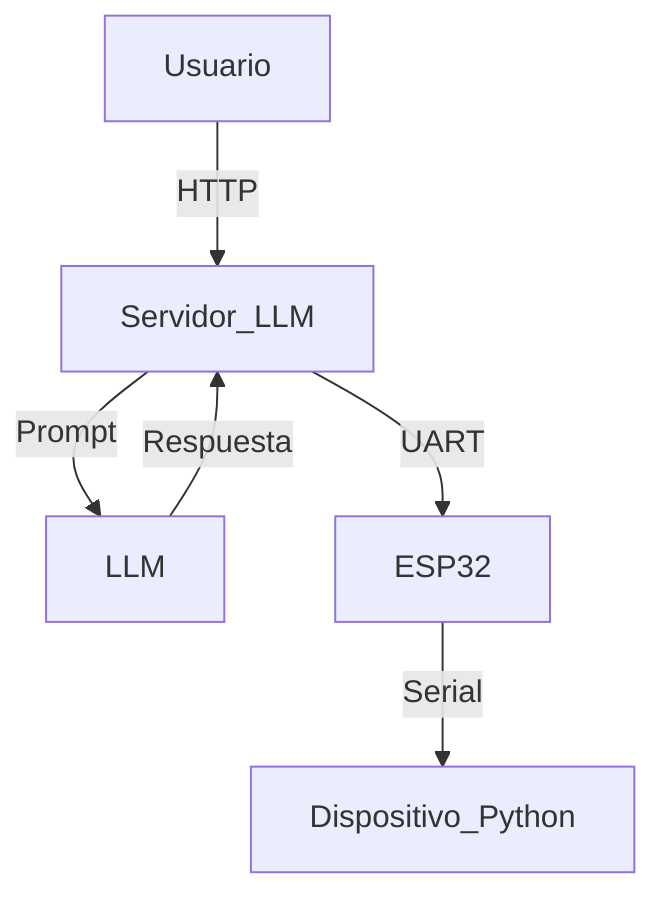

<p align="center">
  
</p>

<p align="center">
  <a href="https://github.com/tu_usuario/tu_repositorio">
    
  </a>
  <a href="https://github.com/tu_usuario/tu_repositorio/issues">
    
  </a>
  <a href="#">
    
  </a>
  <a href="#">
    
  </a>
  <a href="https://github.com/tu_usuario/tu_repositorio/commits/main">
    
  </a>
</p>


EspressIDEA es una plataforma de desarrollo remoto y asistido para microcontroladores que ejecutan Python (MicroPython y CircuitPython). Aprovecha un microcontrolador ESP32 que actúa como un intermediario inteligente, permitiendo:

- Interfaz serial con dispositivos Python (por UART) como si fueran conectados por USB a un PC.

- Servidor web embebido que proporciona un editor de código accesible por navegador.

- Integración con modelos de lenguaje (LLM) para generar, explicar y documentar código en tiempo real.

- Compatibilidad con placas sin WiFi nativo, como Raspberry Pi Pico, Metro, Feather M4, entre otras.


## 🧭 Tabla de Contenidos

- [Descripción](#descripción)
- [Características](#características)
- [Arquitectura del Proyecto](#arquitectura-del-proyecto)
- [Instalación](#instalación)
- [Uso](#uso)
- [Montaje de Hardware](#montaje-de-hardware)
- [Ejemplos](#ejemplos)
- [Contribuir](#contribuir)
- [Licencia](#licencia)
- [Créditos](#créditos)

---

## 📖 Descripción

**EspressIDEA** es una plataforma de desarrollo remoto y asistido para microcontroladores que ejecutan Python (MicroPython y CircuitPython).  
Aprovecha un microcontrolador ESP32 actuando como intermediario inteligente y un servidor de IA que permite generar, explicar y ejecutar código en tiempo real.

Su objetivo es facilitar la creación de proyectos educativos y prototipos robóticos sin necesidad de experiencia avanzada en programación embebida.

---

## ✨ Características

- 🟢 Interfaz serial UART con dispositivos Python, como si fueran conectados vía USB.
- 🟢 Servidor web embebido que actúa como editor de código accesible por navegador.
- 🟢 Integración con modelos de lenguaje (Gemini, Ollama) para generación de código.
- 🟢 Soporte para placas sin WiFi nativo (Pi Pico, Metro, Feather).
- 🟢 Almacenamiento de historial de consultas y ejemplos.
- 🟢 Código de ejemplo y documentación en proceso de desarrollo.

---

## 🏗️ Arquitectura del Proyecto

```markdown


## 📌 Requisitos previos:

- Python 3.8+

- Dependencias de servidor LLM (Flask, google.genai)

- ESP32 configurado con MicroPython/CircuitPython

- (Opcional) Ollama instalado si usarás ese modelo local


## Pasos básicos:

Clonar el repositorio:
```git clone https://github.com/TU_USUARIO/EspressIDEA.git
```
Instalar dependencias:
```
cd Servidor_LLM
```
```
pip install -r requirements.txt
```
Configurar variables de entorno:
```
export GEMINI_API_KEY="TU_API_KEY"
```
